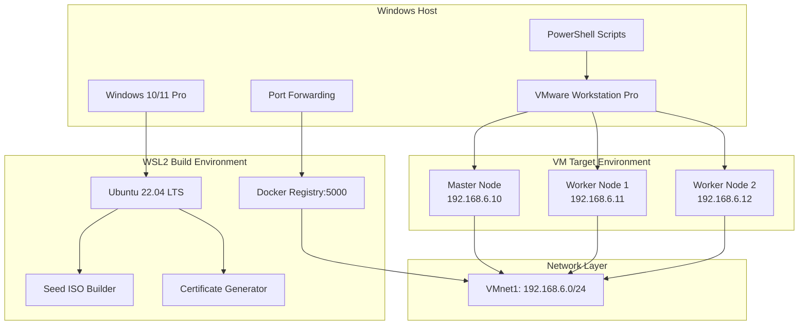
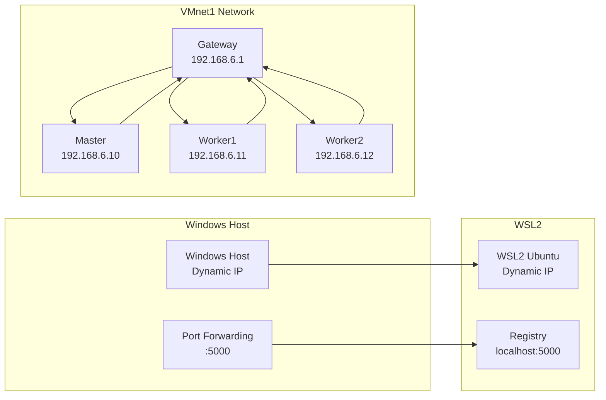

# 설계 문서

## 개요

에어갭 쿠버네티스 랩 환경은 Windows 호스트에서 VMware Workstation을 사용하여 완전히 오프라인으로 k3s 클러스터와 KubeSphere를 구축하는 시스템입니다. 이 시스템은 3계층 아키텍처(Windows 호스트, WSL2 빌드 환경, VM 타겟 환경)를 사용하여 보안이 중요한 환경에서도 쿠버네티스 학습과 개발이 가능하도록 설계되었습니다.

## 아키텍처

### 전체 시스템 아키텍처



### 네트워크 아키텍처



## 구성 요소 및 인터페이스

### 1. Windows 호스트 계층

#### PowerShell 스크립트 모듈
- **check-env.ps1**: 환경 검증 및 사전 요구사항 확인
- **setup-port-forwarding.ps1**: WSL2와 VM 네트워크 간 포트 포워딩 설정
- **setup-vms.ps1**: VM 생성 및 관리 (Setup-VMs.ps1 호출)
- **cleanup-vms.ps1**: VM 정리 및 리소스 해제
- **test-registry-access.ps1**: 레지스트리 접근성 테스트

#### VMware 통합 모듈
- **Setup-VMs.ps1**: 메인 VM 생성 및 관리 스크립트
  - VM 생성 및 설정
  - vmrun 명령어 실행 및 게스트 상태 모니터링
  - ISO 자동 연결/해제
  - SSH 폴백 메커니즘

### 2. WSL2 빌드 환경 계층

#### 오프라인 준비 모듈
- **00_prep_offline_fixed.sh**: 오프라인 환경 준비
  - Docker 레지스트리 시작
  - 컨테이너 이미지 미러링 (26개 이미지)
  - k3s 바이너리 다운로드
  - TLS 인증서 생성 (SAN 포함)
  - SSH 키 쌍 생성

#### ISO 빌드 모듈
- **01_build_seed_isos.sh**: Ubuntu Seed ISO 생성
  - Ubuntu 22.04.5 LTS 기반 ISO 생성
  - cloud-init 템플릿 통합
  - 운영 패키지 포함 (jq, htop, ethtool 등)
  - GRUB 설정 및 autoinstall 파라미터 주입

#### 클러스터 검증 모듈
- **02_wait_and_config.sh**: 클러스터 상태 확인 및 kubectl 설정
  - VM SSH 연결 확인
  - k3s 서비스 상태 점검
  - WSL kubectl 자동 설정
  - TLS 인증서 문제 해결

### 3. VM 타겟 환경 계층

#### Cloud-init 자동화 시스템
- **user-data-master.tpl**: 마스터 노드 템플릿
  - k3s 서버 설정 및 시작
  - TLS SAN 설정
  - KubeSphere 컴포넌트 배포
  - 시간 동기화 서비스

- **user-data-worker.tpl**: 워커 노드 템플릿
  - k3s 에이전트 설정 및 시작
  - 마스터 노드 자동 조인
  - 레지스트리 설정 복사

#### 시스템 서비스
- **k3s-bootstrap.service**: k3s 클러스터 부트스트랩
- **k3s-agent-bootstrap.service**: 워커 노드 조인
- **sync-time.service**: 시간 동기화
- **k8s-ops-packages.service**: 운영 패키지 설치

## 데이터 모델

### 설정 데이터 구조

```yaml
# 네트워크 설정
network:
  vmnet: "VMnet1"
  subnet: "192.168.6.0/24"
  gateway: "192.168.6.1"
  registry_port: 5000
  nodes:
    master: "192.168.6.10"
    workers: ["192.168.6.11", "192.168.6.12"]

# 버전 정보
versions:
  k3s: "v1.33.4-rc1+k3s1"
  kubesphere: "v4.1.3"
  ubuntu: "22.04.5"
  docker_registry: "2.8.1"

# 이미지 목록
images:
  kubernetes_core: 4
  kubesphere_core: 2
  monitoring: 3
  prometheus_stack: 2
  grafana: 1
  rancher_mirrored: 4
  additional: 2
  total: 26
```

### VM 설정 모델

```yaml
# VM 사양
vm_specs:
  memory: "4GB"  # 기본값, 사용자 정의 가능
  cpu: 2         # 기본값, 사용자 정의 가능
  disk: "40GB"   # 기본값, 사용자 정의 가능
  network: "VMnet1"
  boot_order: "disk,cdrom"

# 보안 설정
security:
  ssh_auth: "key_only"
  password_auth: false
  root_login: false
  tls_certificates: true
  ca_certificates: true
```

## 오류 처리

### 1. 환경 검증 오류 처리

```powershell
# 환경 검증 실패 시 처리
if (-not (Test-AdminPrivileges)) {
    Write-Error "관리자 권한이 필요합니다"
    exit 1
}

if (-not (Test-VMwareInstallation)) {
    Write-Error "VMware Workstation Pro가 설치되지 않았습니다"
    exit 1
}
```

### 2. 네트워크 연결 오류 처리

```bash
# 레지스트리 접근 실패 시 폴백
if ! curl -k https://192.168.6.1:5000/v2/ >/dev/null 2>&1; then
    echo "레지스트리 접근 실패, 포트 포워딩 확인 필요"
    # 폴백: build-timestamp 사용
    if [ -f /usr/local/seed/files/build-timestamp ]; then
        date -s "@$(cat /usr/local/seed/files/build-timestamp)"
    fi
fi
```

### 3. VM 생성 오류 처리

```powershell
# vmrun 명령 실패 시 SSH 폴백
try {
    $result = & vmrun -T ws runProgramInGuest $vmxPath "/bin/echo" "test"
} catch {
    Write-Warning "vmrun 실패, SSH 폴백 사용"
    $result = ssh -i $sshKey ubuntu@$vmIP "echo test"
}
```

### 4. 시간 동기화 오류 처리

```bash
# 다단계 시간 동기화 폴백
sync_time() {
    # 1차: 레지스트리 HTTP Date 헤더
    if sync_from_registry; then
        return 0
    fi
    
    # 2차: build-timestamp 파일
    if sync_from_timestamp; then
        return 0
    fi
    
    # 3차: 시스템 기본 시간 유지
    echo "시간 동기화 실패, 기본 시간 사용"
    return 1
}
```

## 테스트 전략

### 1. 단위 테스트

#### PowerShell 스크립트 테스트
```powershell
# 환경 검증 함수 테스트
Describe "Environment Validation" {
    It "Should detect VMware installation" {
        Test-VMwareInstallation | Should -Be $true
    }
    
    It "Should detect WSL2 installation" {
        Test-WSL2Installation | Should -Be $true
    }
}
```

#### Bash 스크립트 테스트
```bash
# 이미지 미러링 테스트
test_image_mirroring() {
    local expected_images=26
    local actual_images=$(curl -s http://localhost:5000/v2/_catalog | jq '.repositories | length')
    
    if [ "$actual_images" -eq "$expected_images" ]; then
        echo "PASS: 이미지 미러링 성공"
        return 0
    else
        echo "FAIL: 예상 $expected_images, 실제 $actual_images"
        return 1
    fi
}
```

### 2. 통합 테스트

#### 전체 워크플로우 테스트
```bash
# E2E 테스트 시나리오
test_full_deployment() {
    echo "1. 환경 검증 테스트"
    ./scripts/check-env.ps1 || return 1
    
    echo "2. 오프라인 준비 테스트"
    ./wsl/scripts/00_prep_offline_fixed.sh || return 1
    
    echo "3. ISO 생성 테스트"
    ./wsl/scripts/01_build_seed_isos.sh || return 1
    
    echo "4. VM 생성 테스트"
    ./windows/Setup-VMs.ps1 || return 1
    
    echo "5. 클러스터 검증 테스트"
    ./wsl/scripts/02_wait_and_config.sh || return 1
}
```

### 3. 성능 테스트

#### 리소스 사용량 모니터링
```powershell
# 메모리 사용량 테스트
$memoryUsage = Get-WmiObject -Class Win32_OperatingSystem | 
    Select-Object @{Name="MemoryUsage";Expression={[math]::round(($_.TotalVisibleMemorySize - $_.FreePhysicalMemory) / $_.TotalVisibleMemorySize * 100, 2)}}

if ($memoryUsage.MemoryUsage -gt 80) {
    Write-Warning "메모리 사용량이 높습니다: $($memoryUsage.MemoryUsage)%"
}
```

#### 네트워크 성능 테스트
```bash
# 레지스트리 응답 시간 테스트
test_registry_performance() {
    local start_time=$(date +%s.%N)
    curl -s http://localhost:5000/v2/_catalog > /dev/null
    local end_time=$(date +%s.%N)
    local response_time=$(echo "$end_time - $start_time" | bc)
    
    echo "레지스트리 응답 시간: ${response_time}초"
}
```

### 4. 보안 테스트

#### SSH 키 인증 테스트
```bash
# SSH 키 기반 인증 확인
test_ssh_key_auth() {
    local ssh_key="./wsl/out/ssh/id_rsa"
    local vm_ip="192.168.6.10"
    
    # 키 기반 인증 테스트
    if ssh -i "$ssh_key" -o PasswordAuthentication=no ubuntu@"$vm_ip" "echo 'SSH OK'"; then
        echo "PASS: SSH 키 인증 성공"
        return 0
    else
        echo "FAIL: SSH 키 인증 실패"
        return 1
    fi
}
```

#### TLS 인증서 검증 테스트
```bash
# TLS 인증서 SAN 확인
test_tls_certificate() {
    local registry_ip="192.168.6.1"
    local cert_info=$(openssl s_client -connect "$registry_ip:5000" -servername "$registry_ip" -showcerts </dev/null 2>/dev/null | openssl x509 -noout -ext subjectAltName)
    
    if echo "$cert_info" | grep -q "IP:$registry_ip"; then
        echo "PASS: TLS SAN 설정 확인"
        return 0
    else
        echo "FAIL: TLS SAN 설정 오류"
        return 1
    fi
}
```

## 배포 및 운영 고려사항

### 1. 시스템 요구사항 검증
- Windows 10/11 Pro (64비트)
- VMware Workstation Pro 16+
- 최소 16GB RAM (권장 32GB)
- 최소 20GB 디스크 여유 공간
- 가상화 지원 (Intel VT-x/AMD-V)

### 2. 보안 고려사항
- SSH 키 기반 인증만 허용
- 루트 로그인 비활성화
- TLS 인증서 SAN 설정
- 네트워크 격리 (Host-Only)
- 최소 권한 원칙

### 3. 모니터링 및 로깅
- VM 상태 모니터링
- k3s 서비스 상태 확인
- 레지스트리 접근성 모니터링
- 시간 동기화 상태 확인

### 4. 백업 및 복구
- VM 스냅샷 생성
- 설정 파일 백업
- SSH 키 및 인증서 백업
- 레지스트리 데이터 백업

### 5. 업그레이드 전략
- k3s 버전 업그레이드 절차
- KubeSphere 버전 업그레이드
- 컨테이너 이미지 업데이트
- 운영 패키지 업데이트