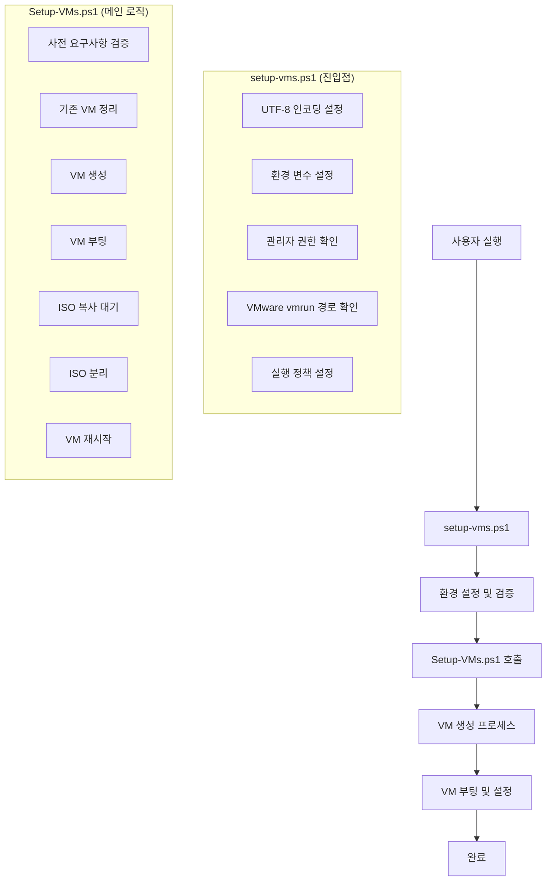
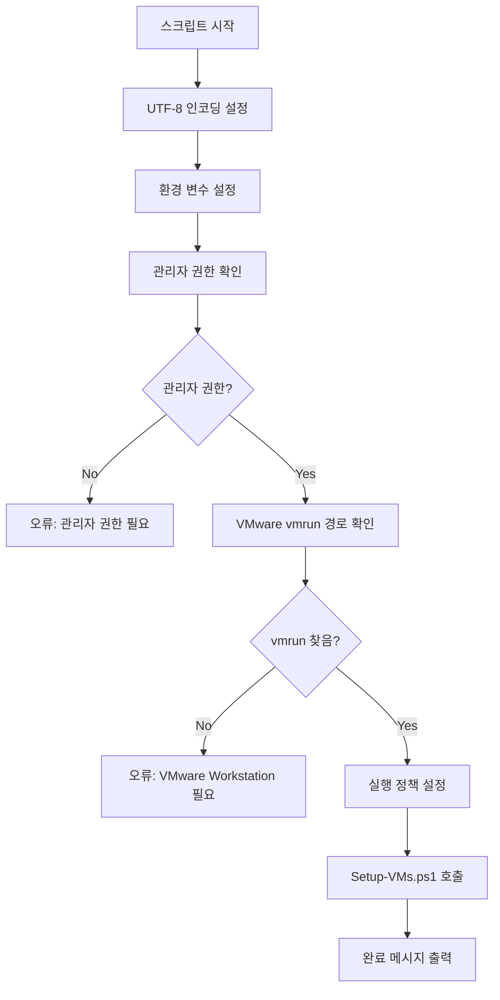
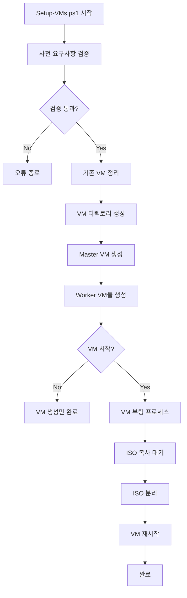
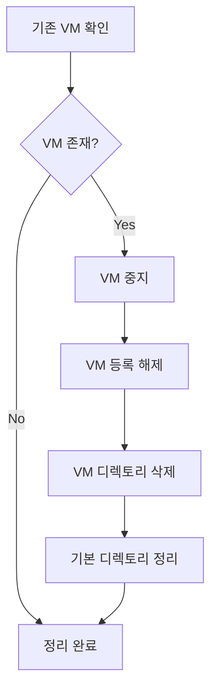
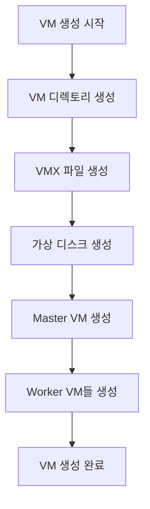
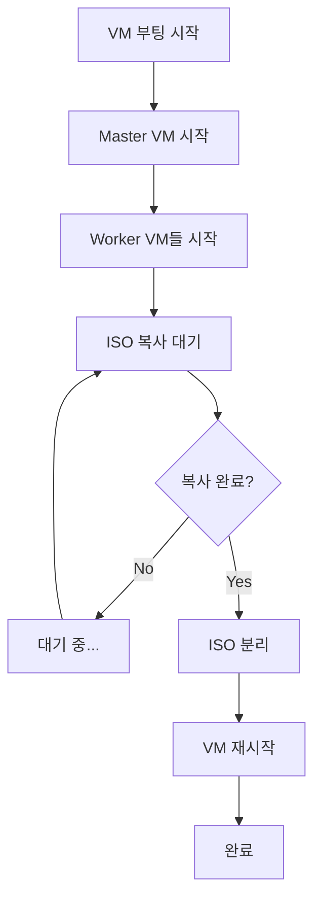
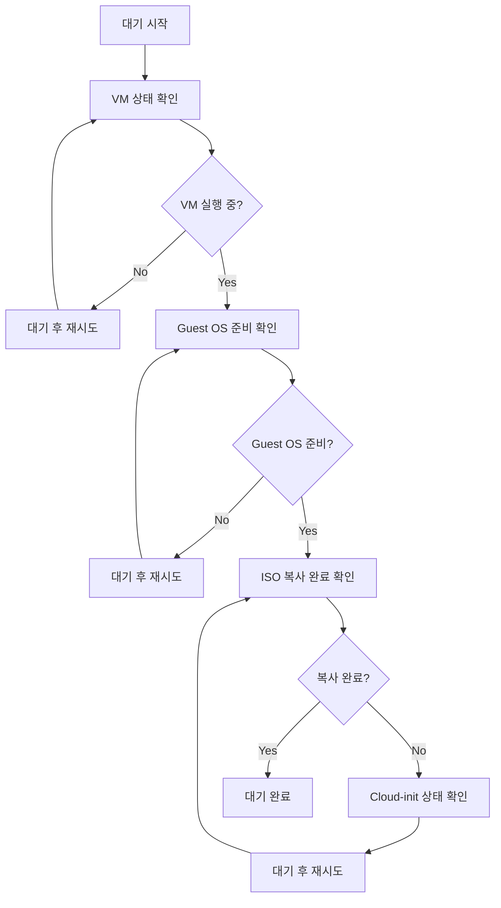
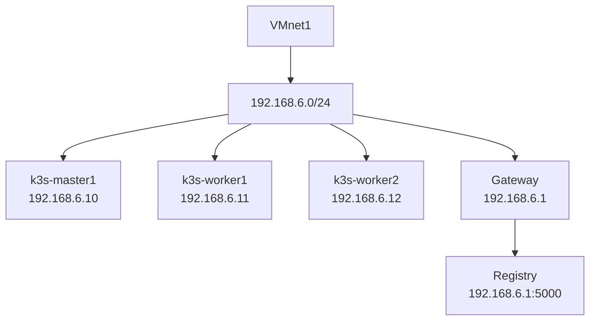
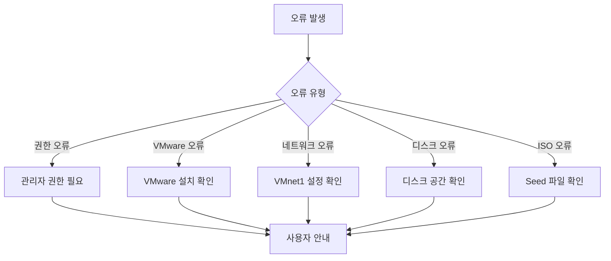

# VM 생성 스크립트 실행 과정 도식화

## 전체 실행 흐름



## 상세 실행 과정

### 1. setup-vms.ps1 (진입점 스크립트)



### 2. Setup-VMs.ps1 (메인 VM 생성 로직)



## 단계별 상세 과정

### Phase 1: 환경 설정 및 검증


**실행되는 검증 항목:**
- ✅ 관리자 권한 확인
- ✅ VMware Workstation Pro 설치 확인
- ✅ vmrun 경로 확인 (`C:\Program Files\VMware\VMware Workstation\vmrun.exe`)
- ✅ Seed 디렉토리 존재 확인 (`./wsl/out`)
- ✅ Seed ISO 파일들 확인 (`seed-master1.iso`, `seed-worker1.iso`, `seed-worker2.iso`)

### Phase 2: 기존 VM 정리



**정리 대상:**
- `k3s-master1`
- `k3s-worker1`
- `k3s-worker2`

### Phase 3: VM 생성



**VMX 설정 내용:**
```ini
# 기본 설정
memsize = "4096"          # 4GB 메모리
numvcpus = "2"            # 2개 CPU
displayName = "k3s-master1"
guestOS = "ubuntu-64"
firmware = "bios"

# 네트워크 설정
ethernet0.connectionType = "hostonly"
ethernet0.vnet = "VMnet1"

# CD-ROM 설정 (Seed ISO)
sata0:1.fileName = "seed-master1.iso"
sata0:1.deviceType = "cdrom-image"
sata0:1.startConnected = "TRUE"

# 부팅 순서
bios.bootOrder = "disk,cdrom"
```

### Phase 4: VM 부팅 및 설정



**부팅 프로세스:**
1. **VM 시작**: `vmrun -T ws start <vmx_path>`
2. **ISO 복사 대기**: `/var/lib/iso-copy-complete` 파일 확인
3. **Cloud-init 완료 대기**: `cloud-init status` 확인
4. **ISO 분리**: VMX에서 `sata0:1.startConnected = "FALSE"`
5. **VM 재시작**: 변경사항 적용

### Phase 5: ISO 복사 대기 로직



**확인 항목:**
- ✅ VM 실행 상태
- ✅ Guest OS 준비 상태
- ✅ ISO 복사 완료 파일 (`/var/lib/iso-copy-complete`)
- ✅ Cloud-init 상태 (`running` → `done`)
- ✅ K8s 패키지 설치 완료 (`/var/lib/k8s-ops-packages-installed`)

## 네트워크 구성



## 파일 구조

```
F:\VMs\AirgapLab\
├── k3s-master1\
│   ├── k3s-master1.vmx
│   └── k3s-master1.vmdk
├── k3s-worker1\
│   ├── k3s-worker1.vmx
│   └── k3s-worker1.vmdk
└── k3s-worker2\
    ├── k3s-worker2.vmx
    └── k3s-worker2.vmdk
```

## 실행 시간 예상

| 단계 | 예상 시간 | 설명 |
|------|-----------|------|
| 환경 검증 | 1-2분 | 사전 요구사항 확인 |
| 기존 VM 정리 | 2-3분 | VM 중지 및 삭제 |
| VM 생성 | 5-10분 | VMX 및 디스크 생성 |
| VM 부팅 | 10-15분 | 초기 부팅 및 설정 |
| ISO 복사 대기 | 15-30분 | Cloud-init 완료 대기 |
| ISO 분리 및 재시작 | 5-10분 | 설정 적용 |
| **총 예상 시간** | **40-70분** | 전체 프로세스 |

## 오류 처리



## 성공 완료 후 상태

**VM 상태:**
- ✅ 모든 VM이 실행 중
- ✅ ISO가 분리되어 재설치 방지
- ✅ Cloud-init 완료
- ✅ K8s 운영 패키지 설치 완료

**접속 정보:**
- **SSH**: `ssh -i ./wsl/out/ssh/id_rsa ubuntu@192.168.6.10`
- **KubeSphere**: `http://192.168.6.10:30880`
- **kubectl**: `k3s kubectl get nodes`

**다음 단계:**
1. `./wsl/scripts/02_wait_and_config.sh` 실행
2. 클러스터 상태 확인
3. KubeSphere 설치 및 설정
