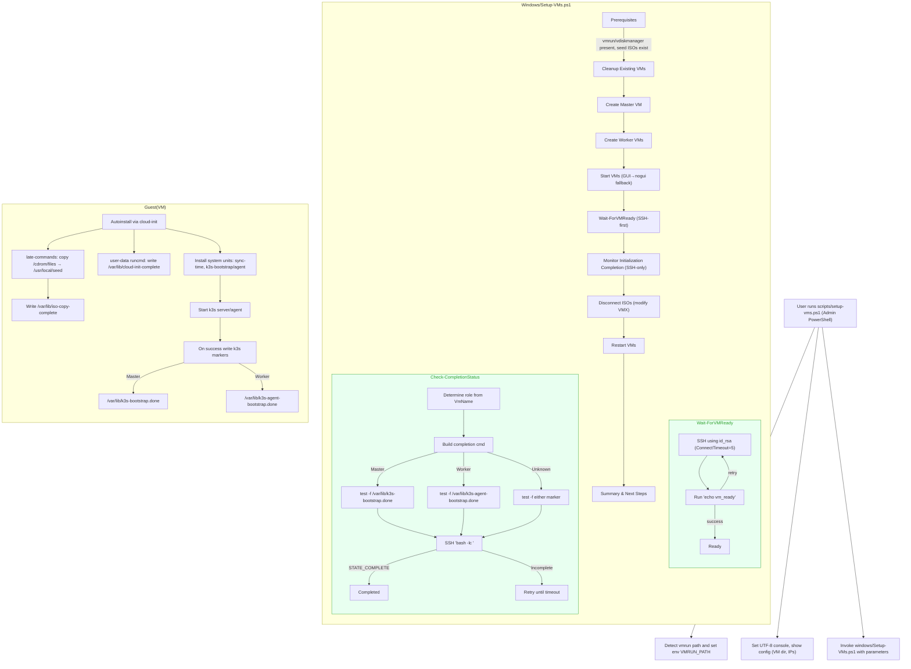

### VM Setup Orchestration (setup-vms.ps1 ↔ Setup-VMs.ps1)

This document illustrates the end-to-end flow between `scripts/setup-vms.ps1` and `windows/Setup-VMs.ps1`, including the SSH-only readiness/completion checks and marker-based completion policy.

Notes:
- Readiness (B6) and Completion (B7) checks are SSH-only; vmrun guest commands are not required.
- Completion requires k3s bootstrap markers only; early markers (`/var/lib/iso-copy-complete`, `/var/lib/cloud-init-complete`) are not sufficient.
